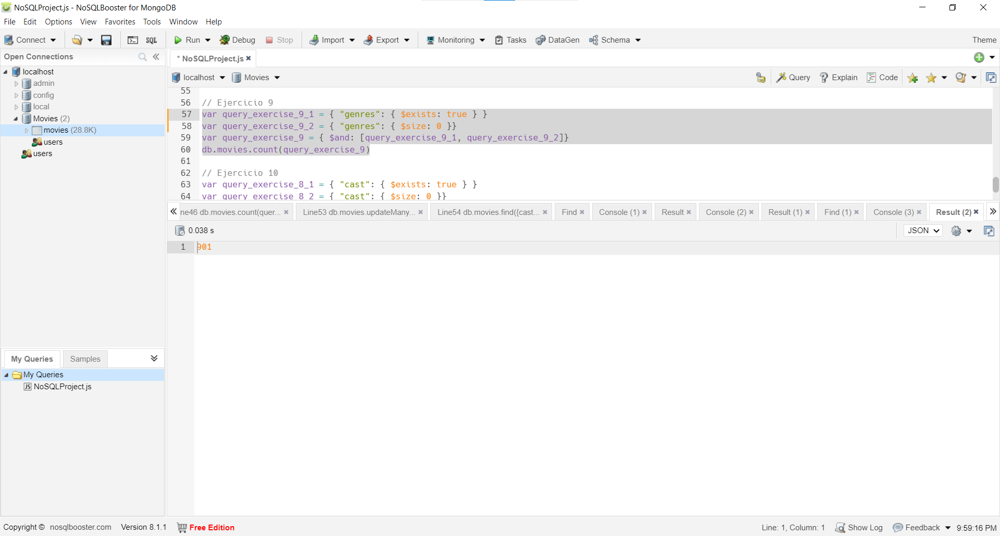
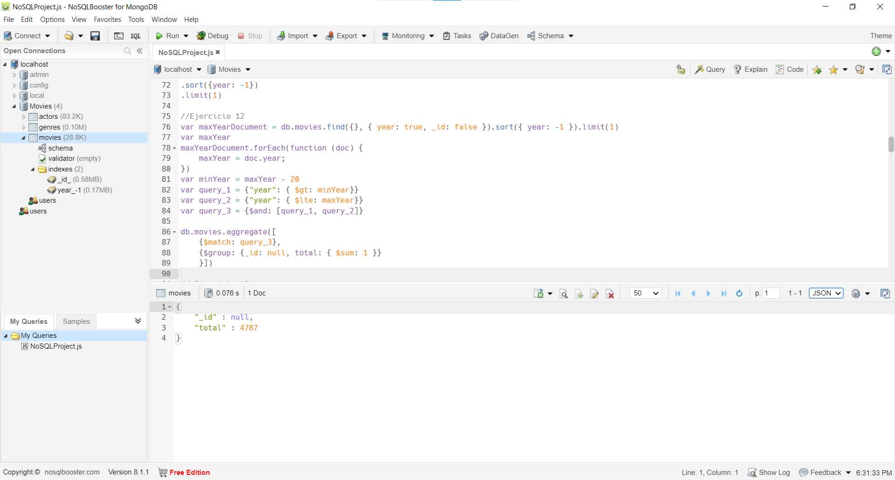

# Proyecto Final NoSQL: Ejercicios MongoDB

## Máster Big Data, Data Science & Inteligencia Artificial

### Proyecto realizado por: Alejandro Borrego Megías
### Fecha: 17 de Noviembre de 2023
### Correo: alejbormeg@gmail.com

---

## Índice
- [Introducción a MongoDB](#introducción-a-mongodb)
- [Prerrequisitos](#prerrequisitos)
- [Clientes Utilizados](#clientes-utilizados)
- [Ejercicios](#ejercicios)

---

## Introducción a MongoDB

MongoDB es un sistema de gestión de bases de datos NoSQL que se ha vuelto ampliamente popular en el ámbito del desarrollo de aplicaciones modernas. A diferencia de las bases de datos relacionales tradicionales, MongoDB utiliza un modelo de datos flexible basado en documentos JSON, lo que permite una escalabilidad horizontal eficiente y una fácil adaptación a los cambios en los esquemas de datos.

## Prerrequisitos

Antes de comenzar con este proyecto, es necesario instalar MongoDB como un servicio de red en su máquina local con sistema operativo Windows. A continuación, se proporcionan los pasos para realizar la instalación:

1. **Descargar MongoDB:**
   Acceda al [sitio web oficial de MongoDB](https://www.mongodb.com/try/download/community) y descargue la versión Community de MongoDB para Windows.

2. **Instalación:**
   Siga las instrucciones de instalación proporcionadas durante el proceso de instalación. Asegúrese de seleccionar la opción para instalar MongoDB como un servicio de red.

3. **Configuración:**
   Después de la instalación, es posible que necesite configurar algunas opciones según sus preferencias. Asegúrese de que el servicio de MongoDB esté iniciado y en ejecución.

## Clientes Utilizados

En este proyecto, se utilizarán dos clientes populares para interactuar con la base de datos MongoDB: Compass y NoSQLBoosterForMongoDB.

1. **MongoDB Compass:**
   Compass es una interfaz gráfica de usuario que facilita la exploración y manipulación de datos en MongoDB. Proporciona herramientas visuales intuitivas para realizar consultas, analizar el rendimiento y diseñar esquemas de datos.

2. **NoSQLBoosterForMongoDB:**
   NoSQLBooster es otra herramienta poderosa para trabajar con MongoDB. Ofrece características avanzadas como autocompletar consultas, un editor de consultas integrado y una interfaz de usuario amigable que agiliza el desarrollo y la administración de bases de datos MongoDB.

## Ejercicios

A continuación, se presentan los ejercicios que explorarán las capacidades de MongoDB en el contexto de NoSQL. Para el primero usaremos el Cliente *MongoDB Compass* y para el resto de ejercicios el cliente *NoSQLBoosterForMongoDB* por tener una interfaz más amigable para las consultas.

0. **Realizar la importación del json en una colección llamada *“movies”***

   El Dataset usado para este ejercicio se encuentra en la carpeta `./Database` en formato `.json`. Para importar el *Dataset* usamos el cliente MongoDB Compass: 

   

   Como podemos observar se ha importado correctamente.

1. **Analizar con find la colección.**

   La query de este ejercicio es la siguiente:

   ```Javascript
   // Ejercicio 1
   db.movies.find()
   ```

   Con ella podemos ver como en total se han insertado 28795 Documentos en la colección *movies*. Además, vemos como el JSON que representa dichos documentos presenta la siguiente estructura (mostramos el primer ejemplo de la colección): 

   ```JSON
   {
      "_id" : ObjectId("6559fc53d1d8f923644f1f3e"),
      "title" : "Caught",
      "year" : 1900,
      "cast" : [ ],
      "genres" : [ ]
   },
   ```

   Vemos que tiene las siguientes propiedades:
   - *title*: es de tipo *string* representando el título de la película.
   - *year*: es de tipo *int32* y representa el año de estreno de la película.
   - *cast: es de tipo *array* y aunque está vacío se deduce que se incluirán aquí los actores que conforman el casting de la película y quizá información relativa a ellos.
   - *generes*: es de tipo *array* y de nuevo en este ejemplo está vacío, pero representará los géneros cinematográficos a los que pertenece dicha película.

   A continuación se muestra una captura de pantalla con el resultado obtenido: 

   

2. **Contar cuántos documentos (películas) tiene cargado.**

   La query de este ejercicio es la siguiente:

   ```Javascript
   // Ejercicio 2
   db.movies.count()
   ```

   El resultado obtenido es que tiene un total de 28795 documentos la colección.

   A continuación se muestra una captura de pantalla con el resultado obtenido: 
   
   

3. **Insertar una película.**
   La query de este ejercicio es la siguiente: 
   
   ```Javascript
   // Ejercicio 3
   var movie = {
      "title" : "El silencio de los corderos",
      "year" : 1991,
      "cast" : ["Anthony Hopkins", "Jodie Foster"],
      "genres" : ["Terror", "Crimen"]
   }
   db.movies.insertOne(movie)
   ```
   El resultado de que se ha insertado correctamente lo podemos ver en la siguiente captura de pantalla:
   

   Para comprobar que verdaderamente se ha insertado hacemos una query para buscarla: 
    ```Javascript
   db.movies.find({title: "El silencio de los corderos"})
   ```

   Obteniendo el siguiente resultado:

   ```JSON
   {
	"_id" : ObjectId("655a0a71f4080f974ab9192e"),
	"title" : "El silencio de los corderos",
	"year" : 1991,
	"cast" : [ "Anthony Hopkins", "Jodie Foster" ],
	"genres" : [ "Terror", "Crimen" ]
   }
   ```

   Podemos verlo también en la siguiente captura de pantalla:
   

4. **Borrar la película insertada en el punto anterior (en el 3).**
   
   La query de este ejercicio es la siguiente:
   ```Javascript
   var movie_to_delete = {
      "title" : "El silencio de los corderos",
      "year" : 1991,
      "cast" : ["Anthony Hopkins", "Jodie Foster"],
      "genres" : ["Terror", "Crimen"]
   }
   db.movies.deleteOne(movie_to_delete)
   ```

   Podemos ver que se ha eliminado en la siguiente captura: 
   

   Para comprobarlo, ejecutamos la siguiente query: 
    ```Javascript
   db.movies.find({title: "El silencio de los corderos"})
   ```

   Obteniendo el resultado de un *array* vacío `[]`. Se puede ver en la siguiente captura: 
   

5. **Contar cuantas películas tienen actores (cast) que se llaman “and”. Estos nombres de actores están por ERROR**

   La query de este ejercicio es la siguiente:

   ```Javascript
   var query_exercise_5 = { "cast": "and" }
   db.movies.count(query_exercise_5)
   ```

   Con esta query estamos filtrando los documentos por aquellos que contienen al menos un "and" en el array del casting (cast) y haciendo un conteo de los documentos totales que cumplen esta condición, obteniendo un total de 93. Esto puede verse en la siguiente captura: 

   

6. **Actualizar los documentos cuyo actor (cast) tenga por error el valor “and” como si realmente fuera un actor. Para ello, se debe sacar únicamente ese valor del array cast. Por lo tanto, no se debe eliminar ni el documento (película) ni su array cast con el resto de actores.**

   La query de este ejercicio es la siguiente:

   ```Javascript
   var query_exercise_6 = { "cast": "and" }
   var action = { $pull: { "cast": "and" } }
   db.movies.updateMany(
   query_exercise_6,
   action
   )
   ```

   En esta query, primero establecemos el criterio de la búsqueda con el primer parámetro de la función `updateMany` (en este caso los documentos que continenen "and" entre sus elementos del array *cast*). En segundo lugar, establecemos la operación a realizar (usamos la acción `$pull` de MongoDB para eliminar el valor "and" del array). Como vemos en la siguiente captura se han modificado los 93 valores anteriores.

   

7. **Contar cuantos documentos (películas) tienen el array ‘cast’ vacío.**

   La query de este ejercicio es la siguiente: 

   ```Javascript
   var query_exercise_7_1 = { "cast": { $exists: true } }
   var query_exercise_7_2 = { "cast": { $size: 0 }}
   var query_exercise_7 = { $and: [query_exercise_7_1, query_exercise_7_2]}
   db.movies.count(query_exercise_7)
   ```
   Con esta query el resultado obtenido es de 986 documentos con el array vacío. Podemos ver el resultado en la siguiente captura:

   

8. **Actualizar TODOS los documentos (películas) que tengan el array cast vacío, añadiendo un nuevo elemento dentro del array con valor Undefined. Cuidado! El tipo de cast debe seguir siendo un array. El array debe ser así -> ["Undefined" ].**

   La query de este ejercicio es la siguiente: 

   ```Javascript
   var query_exercise_8_1 = { "cast": { $exists: true } }
   var query_exercise_8_2 = { "cast": { $size: 0 }}
   var query_exercise_8 = { $and: [query_exercise_8_1, query_exercise_8_2]}
   var action = { $push: { "cast": "Undefined" } }
   db.movies.updateMany(query_exercise_8, action)
   db.movies.find({cast: "Undefined"})
   ```
   Con esta query el resultado obtenido es que se actualizan 986 documentos con el array vacío poniendo el valor "Undefined". Podemos ver el resultado en la siguiente captura:

   

   Como se aprecia en la captura, se mantiene el tipo de dato array para *cast*.

9. **Contar cuantos documentos (películas) tienen el array genres vacío.**

   La query de este ejercicio es la siguiente: 

   ```Javascript
   var query_exercise_9_1 = { "genres": { $exists: true } }
   var query_exercise_9_2 = { "genres": { $size: 0 }}
   var query_exercise_9 = { $and: [query_exercise_9_1, query_exercise_9_2]}
   db.movies.count(query_exercise_9)
   ```
   Con esta query el resultado obtenido es de 901 documentos con el array vacío. Podemos ver el resultado en la siguiente captura:

   

10. **Actualizar TODOS los documentos (películas) que tengan el array genres vacío, añadiendo un nuevo elemento dentro del array con valor Undefined. Cuidado! El tipo de genres debe seguir siendo un array.**

   La query de este ejercicio es la siguiente: 

   ```Javascript
   var query_exercise_10_1 = { "genres": { $exists: true } }
   var query_exercise_10_2 = { "genres": { $size: 0 }}
   var query_exercise_10 = { $and: [query_exercise_10_1, query_exercise_10_2]}
   var action = { $push: { "genres": "Undefined" } }
   db.movies.updateMany(query_exercise_10, action)
   db.movies.find({genres: "Undefined"})
   ```
   Con esta query el resultado obtenido es que se actualizan 901 documentos con el array vacío poniendo el valor "Undefined". Podemos ver el resultado en la siguiente captura:

   

   Como se aprecia en la captura, se mantiene el tipo de dato array para *genres*.

11. **Mostrar el año más reciente / actual que tenemos sobre todas las películas**
   La query de este ejercicio es la siguiente: 

   ```Javascript
   db.movies.find({}, {year: true, _id:false})
   .sort({year: -1})
   .limit(1)
   ```
   En primer lugar obtenemos todos los documentos de la colección con el filtro `{}`, en segundo lugar aplicamos la proyección `{year: true, _id:false}` que hace que solo se muestre el campo año y además (porque se muestra siempre por defecto) eliminamos el campo `_id` para obtener un resultado como el pedido.

   Con esta query el resultado obtenido es el siguiente:
   ```JSON
   {
	"year" : 2018
   }
   ```
   Lo que indica que el año más reciente es 2018. A continuación se proporciona una captura de pantalla con la query y el resultado:
   

12. **Contar cuántas películas han salido en los últimos 20 años. Debe hacerse desde el último año que se tienen registradas películas en la colección, mostrando el resultado total de esos años. Se debe hacer con el Framework de Agregación.**
   El código de este ejercicio es el siguiente: 

   ```Javascript
   var maxYearDocument = db.movies.find({}, { year: true, _id: false }).sort({ year: -1 }).limit(1)
   var maxYear
   maxYearDocument.forEach(function (doc) {
      maxYear = doc.year;
   })
   var minYear = maxYear - 20
   var query_1 = {"year": { $gte: minYear}}
   var query_2 = {"year": { $lte: maxYear}}
   var query_3 = {$and: [query_1, query_2]}

   db.movies.aggregate([
      {$match: query_3},
      {$group: {_id: 0, totalFilms: { $sum: 1 }}
      }])
   ```
   En este ejercicio, primero tratamos de calcular dinámicamente el año máximo de la base de datos, para ello realizamos la query del ejercicio anterior, y teniendo en cuenta que *javascript* devuelve un *promise* como resultado de la búsqueda, para acceder al valor necesitamos ejecutar un *foreach* para setear el valor de la variable que representa el año máximo. En segundo lugar seteamos la variable que representa el año mínimo de la búsqueda (20 años menos) y realizamos la agregación. En primer lugar hacemos un match de los documentos con la fecha comprendida entre los valores deseados y luego un agrupamiento de los mismos, mandamos todos los documentos al mismo grupo (`_id : 0`) y sumamos la cantidad total de documentos.

   Con esta query el resultado obtenido es el siguiente:
   ```JSON
   {
      "_id" : null,
      "total" : 5029
   }
   ```
   La captura de pantalla del ejercicio es esta:
   

13. **Contar cuántas películas han salido en la década de los 60 (del 60 al 69 incluidos). Se debe hacer con el Framework de Agregación**
   El código de este ejercicio es el siguiente: 

   ```Javascript
   var query_1 = {"year": { $gte: 1960}}
   var query_2 = {"year": { $lte: 1969}}
   var query_3 = {$and: [query_1, query_2]}

   db.movies.aggregate([
      {$match: query_3},
      {$group: {_id: 0, totalFilms: { $sum: 1 }}
      }])
   ```
   En este realizamos algo similar al anterior, con la diferencia de que esta vez conocemos el rango de fechas sin necesidad de calcularlo dinámicamente. Por ello únicamente ejecutamos el pipeline de agregación anterior con el nuevo rango de fechas.

   Con esta query el resultado obtenido es el siguiente:
   ```JSON
   {
      "_id" : null,
      "total" : 1414
   }
   ```
   La captura de pantalla del ejercicio es esta:
   

14. **Mostrar el año u años con más películas mostrando el número de películas de ese año. Revisar si varios años pueden compartir tener el mayor número de películas.**

   El código de este ejercicio es el siguiente: 

   ```Javascript
   db.movies.aggregate([
    { $group: { _id: "$year", totalFilms: { $sum: 1 } } },
    { $group: { _id: "$totalFilms", years: { $push: "$_id" } }},
    { $sort: { _id: -1 } },
    { $limit: 1},
    { 
        $unwind: "$years" 
    },
    {
        $replaceRoot: {
            newRoot: {
                _id: "$years",
                pelis: "$_id"
            }
        }
    },
    {$sort: { _id: -1 }}
   ]);
   ```
   En primer lugar agrupamos por año y contabilizamos el total de películas por año. Después agrupamos en función del total de películas y en los nuevos documentos incluimos un array de años en los que se hicieron esa cantidad de películas. Ordenamos de mayor a menor, de esta forma en el primer documento obtenemos el máximo de películas en un año así como en un array los años en que se hicieron esa cantidad de películas. Finalmente con `$unwind` creamos un nuevo documento por cada año en el array `years`. Finalmente reestructuramos los documentos añadiendo el año como `_id` y el total de pelis como el `_id` de los documentos previos a la transformación (dónde en el `_id` estaba el total de pelis de ese año). Finalmente, ordenamos descendentemente según el año. 

   Con esta query el resultado obtenido es el siguiente:
   ```JSON
   {
	"_id" : 1919,
	"pelis" : 634
   }
   ```
   Siendo 1919 el año con más películas en la base de datos, con un total de 634. La captura de pantalla del ejercicio es esta:
   

15. **Mostrar el año u años con más películas mostrando el número de películas de ese año. Revisar si varios años pueden compartir tener el mayor número de películas.**

   El código de este ejercicio es el siguiente: 

   ```Javascript
   db.movies.aggregate([
    { $group: { _id: "$year", totalFilms: { $sum: 1 } } },
    { $group: { _id: "$totalFilms", years: { $push: "$_id" } }},
    { $sort: { _id: 1 } },
    { $limit: 1},
    { 
        $unwind: "$years" 
    },
    {
        $replaceRoot: {
            newRoot: {
                _id: "$years",
                pelis: "$_id"
            }
        }
    },
    {$sort: { _id: -1 }}
   ]);
   ```
   El razonamiento es idéntico al anterior pero ordenando los primeros grupos de menor a mayor por el total de películas en lugar de mayor a menor.

   Con esta query el resultado obtenido es el siguiente:
   ```JSON
   /* 1 */
   {
      "_id" : 1907,
      "pelis" : 7
   },

   /* 2 */
   {
      "_id" : 1906,
      "pelis" : 7
   },

   /* 3 */
   {
      "_id" : 1902,
      "pelis" : 7
   }
   ```
   Siendo así 1907, 1906 y 1902 los años con menos películas de la base de datos con un total de 7. La captura de pantalla del ejercicio es esta:
   

16. **Guardar en nueva colección llamada “actors” realizando la fase $unwind por actor. Después, contar cuantos documentos existen en la nueva colección.**

   El código de este ejercicio es el siguiente: 

   ```Javascript
   db.movies.aggregate([
    { $unwind: "$cast" },
    { $project: {"_id": false}}
    { $out: "actors"}
   ]);

   db.actors.count()
   ```
   Con esto en primer lugar realizamos un `unwind` para partir cada documento en tantos como actores haya en el array de cast. Tras esto eliminamos el `_id` de los documentos para evitar errores al crear la nueva colección. Finalmente contamos el total de actores, como se pide en la nueva colección, obteniendo 83224 documentos.

   La captura de pantalla del ejercicio es esta:
   

17. **Sobre actors (nueva colección), mostrar la lista con los 5 actores que han participado en más películas mostrando el número de películas en las que ha participado. Importante! Se necesita previamente filtrar para descartar aquellos actores llamados "Undefined". Aclarar que no se eliminan de la colección, sólo que filtramos para que no aparezcan.**

   El código de este ejercicio es el siguiente: 

   ```Javascript
  db.actors.aggregate([
    { $match: { cast: { $ne: "Undefined" } } },
    { $group: { _id: "$cast", cuenta: { $sum: 1 } } },
    { $sort: { cuenta: -1 } },
    { $limit: 5 }
   ]);
   ```
   Filtramos para eliminar los actores `Undefined`. Tras esto agrupamos por actor contando las películas en las que aparece. Finalmente ordenamos de mayor a menor y nos quedamos con las primeras 5. El resultado es el siguiente:

   ```JSON
      /* 1 */
      {
         "_id" : "Harold Lloyd",
         "cuenta" : 190
      },

      /* 2 */
      {
         "_id" : "Hoot Gibson",
         "cuenta" : 142
      },

      /* 3 */
      {
         "_id" : "John Wayne",
         "cuenta" : 136
      },

      /* 4 */
      {
         "_id" : "Charles Starrett",
         "cuenta" : 116
      },

      /* 5 */
      {
         "_id" : "Bebe Daniels",
         "cuenta" : 103
      }
   ```

   La captura de pantalla del ejercicio es esta:
   

18. **Sobre actors (nueva colección), agrupar por película y año mostrando las 5 en las que más actores hayan participado, mostrando el número total de actores.**

   El código de este ejercicio es el siguiente: 

   ```Javascript
  db.actors.aggregate([
    { $match: { cast: { $ne: "Undefined" } } },
    { $group: { _id: { title: "$title", year:"$year"}, cuenta: { $sum: 1 } } },
    { $sort: { cuenta: -1 } },
    { $limit: 5 }
   ]);
   ```
   Filtramos para eliminar los actores `Undefined`. Tras esto agrupamos por película y año, contando las ocurrencias (que coinciden con el número de actores que participan, pues la collección surgió de hacer un `$unwind` sobre el campo cast). Finalmente ordenamos de mayor a menor y nos quedamos con las primeras 5 películas. El resultado es el siguiente: 

   ```JSON
   /* 1 */
   {
      "_id" : {
         "title" : "The Twilight Saga: Breaking Dawn - Part 2",
         "year" : 2012
      },
      "cuenta" : 35
   },

   /* 2 */
   {
      "_id" : {
         "title" : "Anchorman 2: The Legend Continues",
         "year" : 2013
      },
      "cuenta" : 33
   },

   /* 3 */
   {
      "_id" : {
         "title" : "Cars 2",
         "year" : 2011
      },
      "cuenta" : 32
   },

   /* 4 */
   {
      "_id" : {
         "title" : "Avengers: Infinity War",
         "year" : 2018
      },
      "cuenta" : 29
   },

   /* 5 */
   {
      "_id" : {
         "title" : "Grown Ups 2",
         "year" : 2013
      },
      "cuenta" : 28
   }
   ```

   La captura de pantalla del ejercicio es esta:
   

19. **Sobre actors (nueva colección), mostrar los 5 actores cuya carrera haya sido la más larga. Para ello, se debe mostrar cuándo comenzó su carrera, cuándo finalizó y cuántos años ha trabajado. Importante! Se necesita previamente filtrar para descartar aquellos actores llamados "Undefined".**

   El código de este ejercicio es el siguiente: 

   ```Javascript
   db.actors.aggregate([
    {$match: { cast: { $ne: "Undefined" } }},
    {$group: { _id: "$cast", years: { $push: "$year" }}},
    {
        $project: {
            comienza: { $min: "$years" },
            termina: { $max: "$years" },
            anos: { $subtract: [{ $max: "$years" }, { $min: "$years" }] }
        }
    },
    { $sort: { anos: -1 } },
    { $limit: 5 }
   ]);
   ```
   Filtramos para eliminar los actores `Undefined`. Tras esto agrupamos por el nombre del actor y añadimos en una lista los años de las películas ordenados de menor a mayor. Tras esto componemos el objeto resultado con una proyección. El resultado es el siguiente:

   ```JSON
   /* 1 */
   {
      "_id" : "Harrison Ford",
      "comienza" : 1919,
      "termina" : 2017,
      "anos" : 98
   },

   /* 2 */
   {
      "_id" : "Gloria Stuart",
      "comienza" : 1932,
      "termina" : 2012,
      "anos" : 80
   },

   /* 3 */
   {
      "_id" : "Kenny Baker",
      "comienza" : 1937,
      "termina" : 2012,
      "anos" : 75
   },

   /* 4 */
   {
      "_id" : "Lillian Gish",
      "comienza" : 1912,
      "termina" : 1987,
      "anos" : 75
   },

   /* 5 */
   {
      "_id" : "Angela Lansbury",
      "comienza" : 1944,
      "termina" : 2018,
      "anos" : 74
   }
   ```
   La captura de pantalla del ejercicio es esta:
   

20. **Sobre actors (nueva colección), Guardar en nueva colección llamada “genres” realizando la fase $unwind por genres. Después, contar cuantos documentos existen en la nueva colección.**
   El código de este ejercicio es el siguiente: 

   ```Javascript
   db.actors.aggregate([
    { $unwind: "$genres" },
    { $project: {"_id": false}},
    { $out: "genres"}
   ]);

   db.genres.count()
   ```

   El resultado de esta query es una nueva colección con 104950 documentos. La captura de pantalla del ejercicio es la siguiente:

   

21. **Sobre genres (nueva colección), mostrar los 5 documentos agrupados por “Año y Género” que más número de películas diferentes tienen mostrando el número total de películas.**

   El código de este ejercicio es el siguiente: 
   ```Javascript
   db.genres.aggregate([
    { $match: { genres: { $ne: "Undefined" } } },
    { $group: { _id: { year: "$year", genre: "$genres" }, uniqueTitles: { $addToSet: "$title" } } },
    { $project: { pelis: { $size: "$uniqueTitles" } } },
    { $sort: { pelis: -1 } },
    { $limit: 5 }
   ]);
   ```

   En primer lugar, se descartan los documentos con género `Undefined`. Tras esto agrupamos por año y género y utilizando un `$addToSet` metemos en una propiedad los títulos de ese año y género de forma que no haya repetidos. Finalmente con una proyección contamos el total de películas, ordenamos de mayor a menor y limitamos el número de documentos a devolver a 5. El resultado obtenido es el siguiente:

   ```JSON
   /* 1 */
   {
      "_id" : {
         "year" : 1919,
         "genre" : "Drama"
      },
      "pelis" : 291
   },

   /* 2 */
   {
      "_id" : {
         "year" : 1925,
         "genre" : "Drama"
      },
      "pelis" : 247
   },

   /* 3 */
   {
      "_id" : {
         "year" : 1924,
         "genre" : "Drama"
      },
      "pelis" : 233
   },

   /* 4 */
   {
      "_id" : {
         "year" : 1919,
         "genre" : "Comedy"
      },
      "pelis" : 226
   },

   /* 5 */
   {
      "_id" : {
         "year" : 1922,
         "genre" : "Drama"
      },
      "pelis" : 209
   }
   ```
   
   La captura de pantalla del ejercicio es la siguiente:

   

22. **Sobre genres (nueva colección), mostrar los 5 actores y los géneros en los que han participado con más número de géneros diferentes, se debe mostrar el número de géneros diferentes que ha interpretado. Importante! Se necesita previamente filtrar para descartar aquellos actores llamados "Undefined".**

   El código de este ejercicio es el siguiente: 
   ```Javascript
   db.genres.aggregate([
    { $match: { cast: { $ne: "Undefined" } } },
    { $match: { genres: { $ne: "Undefined" } } },
    { $group: { _id: "$cast", generos: { $addToSet: "$genres" } } },
    { $project: { numgeneros: { $size: "$generos" }, generos: 1 } },
    { $sort: { numgeneros: -1} },
    { $limit: 5 }
   ]);
   ```

   En primer lugar filtramos para evitar el género y actor `Undefined`. Tras esto agrupamos por actor y creamos un conjunto de géneros para cada actor sin repetidos (con el `$addToSet`). Tras esto hacemos una proyección mostrando el conjunto de géneros y el total de elementos en el conjunto, ordenamos de mayor a menor y limitamos a 5. El resultado obtenido es el siguiente: 

   ```JSON
   /* 1 */
   {
      "_id" : "Dennis Quaid",
      "generos" : [
         "Fantasy",
         "Disaster",
         "Musical",
         "Science Fiction",
         "Adventure",
         "Satire",
         "Sports",
         "Western",
         "Action",
         "Family",
         "Thriller",
         "Animated",
         "Dance",
         "Comedy",
         "Romance",
         "Drama",
         "Biography",
         "Suspense",
         "Horror",
         "Crime"
      ],
      "numgeneros" : 20
   },

   /* 2 */
   {
      "_id" : "James Mason",
      "generos" : [
         "Adventure",
         "Fantasy",
         "Musical",
         "Science Fiction",
         "War",
         "Action",
         "Western",
         "Short",
         "Thriller",
         "Animated",
         "Noir",
         "Romance",
         "Drama",
         "Comedy",
         "Biography",
         "Suspense",
         "Mystery",
         "Crime"
      ],
      "numgeneros" : 18
   },

   /* 3 */
   {
      "_id" : "James Coburn",
      "generos" : [
         "Adventure",
         "Spy",
         "Science Fiction",
         "War",
         "Satire",
         "Sports",
         "Action",
         "Western",
         "Family",
         "Thriller",
         "Animated",
         "Comedy",
         "Romance",
         "Drama",
         "Biography",
         "Suspense",
         "Mystery",
         "Crime"
      ],
      "numgeneros" : 18
   },

   /* 4 */
   {
      "_id" : "Gene Hackman",
      "generos" : [
         "Disaster",
         "Adventure",
         "Science Fiction",
         "Spy",
         "War",
         "Sports",
         "Action",
         "Western",
         "Thriller",
         "Superhero",
         "Animated",
         "Comedy",
         "Noir",
         "Drama",
         "Biography",
         "Suspense",
         "Mystery",
         "Crime"
      ],
      "numgeneros" : 18
   },

   /* 5 */
   {
      "_id" : "Michael Caine",
      "generos" : [
         "Disaster",
         "Crime",
         "Spy",
         "Science Fiction",
         "War",
         "Action",
         "Family",
         "Thriller",
         "Superhero",
         "Animated",
         "Comedy",
         "Romance",
         "Drama",
         "Biography",
         "Suspense",
         "Mystery",
         "Horror",
         "Adventure"
      ],
      "numgeneros" : 18
   }
   ```
   La captura de pantalla del ejercicio es la siguiente:

   

23. **Sobre genres (nueva colección), mostrar las 5 películas y su año correspondiente en los que más géneros diferentes han sido catalogados, mostrando esos géneros y el número de géneros que contiene.**
   La query del ejercicio es la siguiente: 

   ```Javascript
   db.genres.aggregate([
   { $match: { genres: { $ne: "Undefined" } } },
   { $group: { _id: { year: "$year", title: "$title" }, generos: { $addToSet: "$genres" } } },
   { $project: { numgeneros: { $size: "$generos" }, generos: true } },
   { $sort: { numgeneros: -1 } },
   { $limit: 5 }
   ]);
   ```
   En primer lugar descartamos los que tienen género `Undefined`, tras esto agrupamos por título de película y año guardando en un conjunto los géneros catalogados para dicha película sin repetidos. Tras esto hacemos una proyección mostrando además el total de elementos en el conjunto. El resultado obtenido es el siguiente: 

   ```JSON
   /* 1 */
   {
      "_id" : {
         "year" : 2017,
         "title" : "American Made"
      },
      "generos" : [
         "Action",
         "Biography",
         "Historical",
         "Comedy",
         "Thriller",
         "Drama",
         "Crime"
      ],
      "numgeneros" : 7
   },

   /* 2 */
   {
      "_id" : {
         "year" : 2017,
         "title" : "Thor: Ragnarok"
      },
      "generos" : [
         "Comedy",
         "Science Fiction",
         "Superhero",
         "Action",
         "Adventure",
         "Fantasy"
      ],
      "numgeneros" : 6
   },

   /* 3 */
   {
      "_id" : {
         "year" : 2017,
         "title" : "My Little Pony: The Movie"
      },
      "generos" : [
         "Fantasy",
         "Animated",
         "Musical",
         "Comedy",
         "Family",
         "Adventure"
      ],
      "numgeneros" : 6
   },

   /* 4 */
   {
      "_id" : {
         "year" : 2017,
         "title" : "The Dark Tower"
      },
      "generos" : [
         "Western",
         "Science Fiction",
         "Action",
         "Adventure",
         "Fantasy",
         "Horror"
      ],
      "numgeneros" : 6
   },

   /* 5 */
   {
      "_id" : {
         "year" : 2017,
         "title" : "Dunkirk"
      },
      "generos" : [
         "Action",
         "Adventure",
         "Thriller",
         "Historical",
         "Drama",
         "War"
      ],
      "numgeneros" : 6
   }
   ```

   La captura de pantalla del ejercicio es la siguiente:

   


24. **Obtén los 3 actores que más de películas de género *Drama* han realizado.**
   La query de este ejercicio es la siguiente:
   ```Javascript
   db.genres.aggregate([
    { $match: { genres: "Drama", cast: { $ne: "Undefined" } } },
    { $group: { _id: "$cast", peliculas: { $addToSet: "$title" } } },
    { $project: { numpeliculas: { $size: "$peliculas" }, peliculas: 1 } },
    { $sort: { numpeliculas: -1} },
    { $limit: 3 }
   ]);
   ```

   En primer lugar hacemos match para tomar aquellas películas de género *Drama* que no tengan como actor ningún *Undefined*. En segundo lugar agrupamos por actor y creamos un set con las películas realizadas con género *Drama*. Finalmente proyectamos por el campo de total de películas y agregamos un conteo del total de películas en el set. Ordenamos de mayor a menor por este campo y tomamos los 3 primeros.

   El resultado obtenido es el siguiente: 
   ```JSON
   /* 1 */
   {
      "_id" : "Bette Davis",
      "peliculas" : [
         "Hell's House",
         "Bordertown",
         "Beyond the Forest",
         "Jezebel",
         "The Dark Horse",
         "That Certain Woman",
         "Storm Center",
         "Where Love Has Gone",
         "Mr. Skeffington",
         "Front Page Woman",
         "The Cabin in the Cotton",
         "Bureau of Missing Persons",
         "The Petrified Forest",
         "20,000 Years in Sing Sing",
         "All About Eve",
         "The Little Foxes",
         "Old Acquaintance",
         "Another Man's Poison",
         "Parachute Jumper",
         "Of Human Bondage",
         "A Stolen Life",
         "The Star",
         "Satan Met a Lady",
         "Three on a Match",
         "The Big Shakedown",
         "Phone Call from a Stranger",
         "The Man Who Played God",
         "The Private Lives of Elizabeth and Essex",
         "Wicked Stepmother",
         "Payment on Demand",
         "Special Agent",
         "In This Our Life",
         "The Girl from 10th Avenue",
         "Marked Woman",
         "The Old Maid",
         "Jimmy the Gent",
         "Watch on the Rhine",
         "The Corn Is Green",
         "Dark Victory",
         "The Catered Affair",
         "The Sisters",
         "The Whales of August",
         "Dangerous",
         "Fashions of 1934",
         "The Scapegoat",
         "Kid Galahad",
         "Housewife",
         "Now, Voyager",
         "The Great Lie",
         "Waterloo Bridge",
         "Way Back Home",
         "Winter Meeting",
         "All This, and Heaven Too",
         "Bad Sister",
         "Fog Over Frisco",
         "The Golden Arrow"
      ],
      "numpeliculas" : 56
   },

   /* 2 */
   {
      "_id" : "Lionel Barrymore",
      "peliculas" : [
         "The Girl Who Wouldn't Work",
         "Sadie Thompson",
         "The Show",
         "The Yellow Ticket",
         "Oil and Water",
         "The Copperhead",
         "A Man of Iron",
         "Broken Lullaby",
         "Rasputin and the Empress",
         "The Little Colonel",
         "The Secret of Dr. Kildare",
         "Three Wise Fools",
         "I Am the Man",
         "Paris at Midnight",
         "The Penalty",
         "Bannerline",
         "The Voice of Bugle Ann",
         "One Man's Journey",
         "Captains Courageous",
         "Guilty Hands",
         "The Road to Glory",
         "Night Flight",
         "The Return of Peter Grimm",
         "This Side of Heaven",
         "Saratoga",
         "Young Dr. Kildare",
         "The Eternal City",
         "3 Men in White",
         "A Free Soul",
         "The Barrier",
         "Children of the Whirlwind",
         "The Lion and the Mouse",
         "Unseeing Eyes",
         "Dr. Gillespie's Criminal Case",
         "A Family Affair",
         "West of Zanzibar",
         "The Washington Masquerade",
         "Sweepings",
         "The Gorgeous Hussy",
         "Jim the Penman",
         "Meddling Women",
         "Calling Dr. Gillespie",
         "Public Hero No. 1",
         "Camille",
         "Road House",
         "Mata Hari",
         "The Wrongdoers",
         "Ah, Wilderness!",
         "Fifty-Fifty",
         "Three Friends",
         "Carolina",
         "Dark Delusion",
         "Dr. Gillespie's New Assistant",
         "Looking Forward",
         "Calling Dr. Kildare"
      ],
      "numpeliculas" : 55
   },

   /* 3 */
   {
      "_id" : "Mary Astor",
      "peliculas" : [
         "Young Ideas",
         "Upper World",
         "The Sin Ship",
         "Claudia and David",
         "A Stranger in My Arms",
         "The Lash",
         "Straight from the Heart",
         "Red Dust",
         "The Price of a Party",
         "Man of Iron",
         "Puritan Passions",
         "Other Men's Women",
         "Scarlet Saint",
         "The Pace That Thrills",
         "Inez from Hollywood",
         "Dodsworth",
         "The Woman from Hell",
         "Unguarded Women",
         "Woman Against Woman",
         "Behind Office Doors",
         "Youngblood Hawke",
         "New Year's Eve",
         "Enticement",
         "Three-Ring Marriage",
         "The Lost Squadron",
         "Playing with Souls",
         "Jennie Gerhardt",
         "The Man with Two Faces",
         "Second Fiddle",
         "Viva Villa!",
         "Act of Violence",
         "Dinky",
         "Cynthia",
         "Men of Chance",
         "Any Number Can Play",
         "Forever After",
         "Dressed to Kill",
         "Smart Woman",
         "The Bright Shawl",
         "The Runaway Bride",
         "The Great Lie",
         "Blonde Fever",
         "Romance of the Underworld",
         "Trapped by Television",
         "White Shoulders",
         "The Fighting Adventurer",
         "Those We Love",
         "I Am a Thief",
         "The World Changes",
         "High Steppers"
      ],
      "numpeliculas" : 50
   }
   ```

   La captura de pantalla del ejercicio es la siguiente: 
   

25.**Obtén para cada género el año en que más películas se hicieron de dicho género (la moda).**
   La query de este ejercicio es la siguiente:

   ```Javascript
   db.genres.aggregate([
      { $match: { genres: { $ne: "Undefined" } } },
      { $group: { _id: { genre: "$genres", year: "$year" }, peliculas: { $addToSet: "$title" } } },
      { $project: { numpeliculas: { $size: "$peliculas" }}},
      { $sort: { numpeliculas: -1 } },
      { $group: { _id: "$_id.genre", anoModa: { $first: "$_id.year" }, numPelisModa: { $first: "$numpeliculas" } } },
      { $project: { _id: 0, genre: "$_id", anoModa: 1, numPelisModa: 1 } },
      { $sort: { numPelisModa: -1 } }
   ])
   ```

   Primero filtramos por entradas con género distinto de "Undefined". Luego agrupamos por género y año los documentos añadiendo en un set sin elementos repetidos todas las películas de ese género y año. En una proyección, añadimos un campo para obtener el total de películas del set. Después ordenamos de mayor a menor de acuerdo con este nuevo campo. Agrupamos esta vez por género, y en el año que representa la moda usamos `$first` para obtener el año del primer documento de cada género (que como estaba ordenado en función del número de películas sabemos que es el que más películas tiene). Finalmente proyectamos el resultado para una lectura más amigable de los documentos, mostrando el género, año de la moda y número de películas. El resultado es el siguiente: 

   ```JSON
   /* 1 */
   {
      "anoModa" : 1919,
      "numPelisModa" : 291,
      "genre" : "Drama"
   },

   /* 2 */
   {
      "anoModa" : 1919,
      "numPelisModa" : 226,
      "genre" : "Comedy"
   },

   /* 3 */
   {
      "anoModa" : 1925,
      "numPelisModa" : 120,
      "genre" : "Western"
   },
   ...
   ```

   El resultado se puede ver en la siguiente captura: 
   

26. **Calcula el promedio de géneros por película en cada año y ordena el resultado de mayor a menor promedio.**

   La query es la siguiente:

   ```Javascript
   db.genres.aggregate([
      { $match: { genres: { $ne: "Undefined" } } },
      { $group: { _id: { year: "$year", title: "$title" }, uniqueGenres: { $addToSet: "$genres" } } },
      { $group: { _id: "$_id.year", totalMovies: { $sum: 1 }, totalGenres: { $sum: { $size: "$uniqueGenres" } } } },
      { $project: { _id: 0, year: "$_id", averageGenresPerMovie: { $divide: ["$totalGenres", "$totalMovies"] } } },
      { $sort: { averageGenresPerMovie: -1 } }
      { $limit: 5 }
   ])
   ```
   En primer lugar, filtramos por aquellos documentos con género distinto a `Undefined`. Después agrupamos por película y año, añadiendo para cada pareja película, año un set con los géneros. Tras esto agrupamos por año asumando el total de películas y el total de géneros. Finalmente proyectamos para una salida más legible y calculamos el promedio de géneros, ordenamos por el promedio de géneros de mayora a menor y nos quedamos con los primeros 5 valores.

   El resultado obtenido es el siguiente: 
   ```JSON
   /* 1 */
   {
      "year" : 2017,
      "promedioGenresPerMovie" : 2.2941176470588234
   },

   /* 2 */
   {
      "year" : 2018,
      "promedioGenresPerMovie" : 2.01271186440678
   },

   /* 3 */
   {
      "year" : 1906,
      "promedioGenresPerMovie" : 1.8571428571428572
   },

   /* 4 */
   {
      "year" : 1902,
      "promedioGenresPerMovie" : 1.75
   },

   /* 5 */
   {
      "year" : 2011,
      "promedioGenresPerMovie" : 1.7313432835820894
   }
   ```

   Como podemos ver el año con mayor número de géneros por película fue 2017 con más de 2 géneros por película de media.

   La captura de pantalla de este ejercicio se muestra a continuación:

   
   El resultado se puede ver en la siguiente captura: 
   